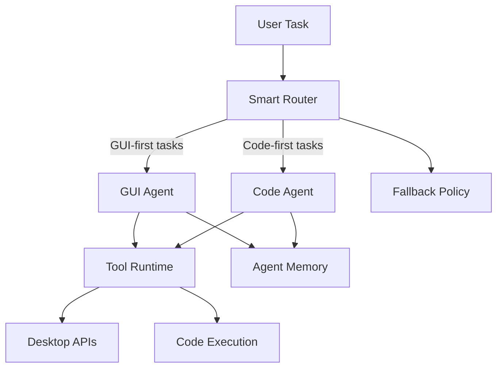

<div align="center">

# Argus Dual-Agent System

Production-oriented dual-agent framework for desktop and code automation.

[](https://www.python.org/)
[](#system-architecture)
[](https://github.com/BerriAI/litellm)
[](https://github.com/sudo-yf/hackathon2512/actions)
[](LICENSE)

</div>

## Overview

Argus 是一个双 Agent 协同自动化系统：`GUI Agent` 负责界面理解与桌面动作，`Code Agent` 负责逻辑分析与代码执行，`Smart Router` 根据任务语义、执行反馈与失败信号进行动态路由与切换。

该项目面向阿里 Agent 挑战赛与 Gemini Hackathon 场景，支持 GUI 形态与 CLI 形态双运行模式。

## Table of Contents

- [Overview](#overview)
- [Core Capabilities](#core-capabilities)
- [System Architecture](#system-architecture)
- [Quick Start](#quick-start)
- [Runtime Modes](#runtime-modes)
- [Environment Variables](#environment-variables)
- [Project Structure](#project-structure)
- [Design References](#design-references)

## Core Capabilities

- Dual-Agent 协同执行（GUI + Code）
- 自动路由与失败兜底切换
- Tool Calling 工具体系（screen/window/mouse/keyboard/code）
- 会话记忆（Agent Memory）
- GUI 可视化运行与 CLI 任务批处理
- 标准化工程能力（uv / Docker / lint / test / CI）

## System Architecture



## Quick Start

### 1. Install Dependencies

```bash
uv sync
```

### 2. Configure Model Endpoints

配置以下环境变量后运行（见下方变量表）：

- `GUIAgent_MODEL`
- `GUIAgent_API_BASE`
- `GUIAgent_API_KEY`
- `CodeAgent_MODEL`
- `CodeAgent_API_BASE`
- `CodeAgent_API_KEY`

### 3. Run

GUI 模式（无参数）：

```bash
uv run python main.py
```

CLI 模式（有参数）：

```bash
uv run python main.py --task "打开浏览器并搜索 GitHub"
```

强制使用某个 Agent：

```bash
uv run python main.py --task "分析当前目录代码结构" --force code
```

### 4. Quality Gates

```bash
make lint
make test
make check
```

## Runtime Modes

| Mode | Command | Target |
|---|---|---|
| GUI | `uv run python main.py` | Windows GUI 自动化 |
| CLI | `uv run python main.py --task "..."` | 跨平台任务编排/验证 |

## Environment Variables

| Variable | Required | Description |
|---|---|---|
| `GUIAgent_MODEL` | Yes | GUI Agent 使用的模型名 |
| `GUIAgent_API_BASE` | No | GUI Agent API Base URL |
| `GUIAgent_API_KEY` | Yes | GUI Agent API Key |
| `CodeAgent_MODEL` | Yes | Code Agent 使用的模型名 |
| `CodeAgent_API_BASE` | No | Code Agent API Base URL |
| `CodeAgent_API_KEY` | Yes | Code Agent API Key |

## Docker (CLI)

```bash
docker build -t argus-dual-agent:latest .
```

```bash
docker run --rm -it \
  -e GUIAgent_MODEL=... \
  -e GUIAgent_API_BASE=... \
  -e GUIAgent_API_KEY=... \
  -e CodeAgent_MODEL=... \
  -e CodeAgent_API_BASE=... \
  -e CodeAgent_API_KEY=... \
  argus-dual-agent:latest
```

## Project Structure

```text
hackathon2512/
├── main.py
├── src/argus/
│   ├── runtime.py
│   ├── bootstrap.py
│   ├── config.py
│   ├── agents/
│   ├── tools/
│   └── ui/
├── tests/
├── Dockerfile
├── Makefile
├── pyproject.toml
└── LICENSE
```

## Design References

- [AutoGen](https://github.com/microsoft/autogen)
- [LangGraph](https://github.com/langchain-ai/langgraph)
- [Open Interpreter](https://github.com/OpenInterpreter/open-interpreter)
- [LiteLLM](https://github.com/BerriAI/litellm)

