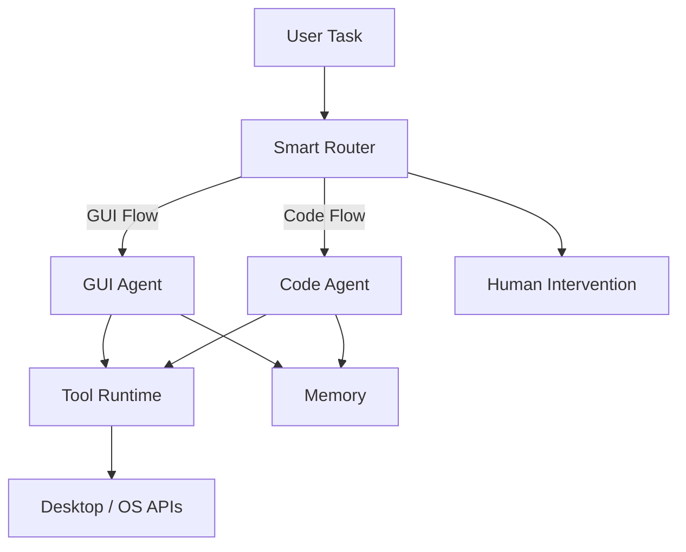

# Argus Dual-Agent System


阿里 Agent 挑战赛与 Gemini Hackathon 作品。  
Argus 使用双 Agent 架构执行桌面自动化任务：GUI Agent 负责视觉与界面动作，Code Agent 负责逻辑和代码执行，Router 负责策略分流与失败切换。

## Highlights

- Dual-Agent orchestration（GUI + Code）
- 规则 + 模型混合路由
- Function Calling 工具链（鼠标/键盘/窗口/截图/代码执行）
- 人工介入回路（复杂失败兜底）
- Windows GUI + cross-platform CLI

## Architecture



## Project Layout

```text
hackathon2512/
├── main.py
├── src/argus/
│   ├── bootstrap.py
│   ├── config.py
│   ├── runtime.py
│   ├── agents/
│   ├── tools/
│   └── ui/
├── tests/
├── .env.example
├── pyproject.toml
├── Makefile
├── Dockerfile
└── RELEASE.md
```

## Quick Start

```bash
uv sync
cp .env.example .env
uv run python main.py
```

CLI mode:

```bash
uv run python main.py --task "打开浏览器并搜索 GitHub"
```

## Local Quality Gates

```bash
make lint
make test
make check
```

## Docker (CLI)

```bash
docker build -t argus-dual-agent:latest .
```

```bash
docker run --rm -it \
  -e GUIAgent_MODEL=... \
  -e GUIAgent_API_BASE=... \
  -e GUIAgent_API_KEY=... \
  -e CodeAgent_MODEL=... \
  -e CodeAgent_API_BASE=... \
  -e CodeAgent_API_KEY=... \
  argus-dual-agent:latest
```

## Runtime Matrix

| Mode | OS | Use Case |
|---|---|---|
| GUI | Windows | 桌面视觉自动化 |
| CLI | Windows / Linux / macOS | 任务编排、代码执行、流程验证 |

## Release Policy

See [RELEASE.md](RELEASE.md)
