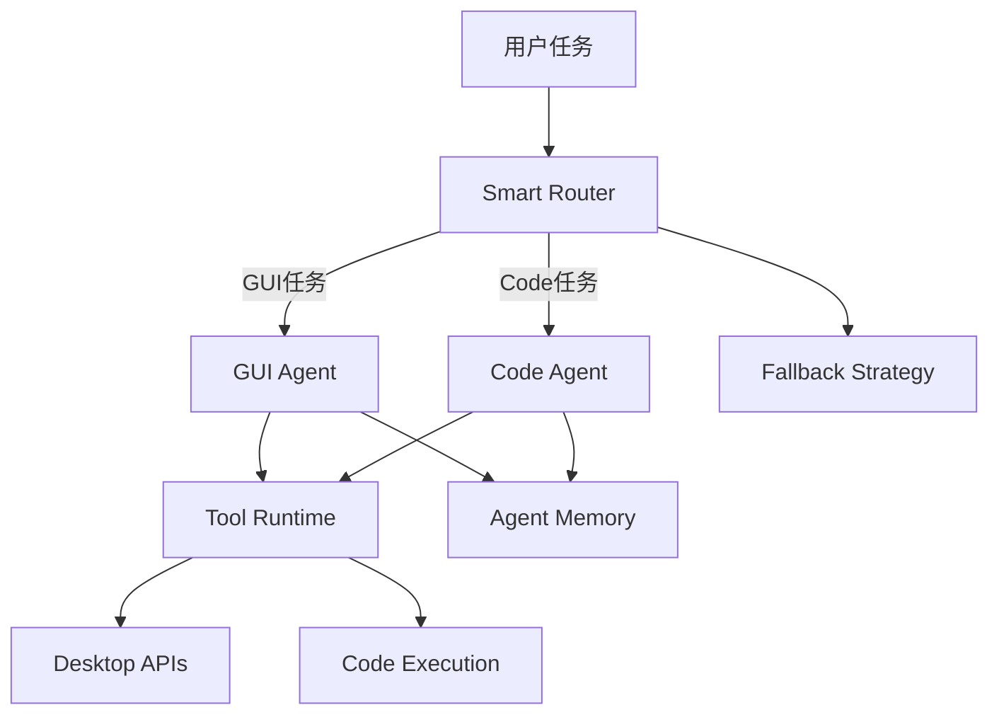

<div align="center">

# Argus Dual-Agent System

面向复杂自动化任务的双 Agent 执行框架

[](https://www.python.org/)
[](#系统架构)
[](https://github.com/BerriAI/litellm)
[](https://github.com/sudo-yf/hackathon2512/actions)
[](LICENSE)

</div>

## 项目简介

Argus 通过 `GUI Agent` 与 `Code Agent` 双路协同执行任务：

- `GUI Agent` 负责屏幕理解、界面操作与流程执行
- `Code Agent` 负责代码分析、脚本执行与逻辑推理
- `Smart Router` 根据任务类型、执行结果与失败信号做动态路由与兜底切换

项目面向阿里 Agent 挑战赛与 Gemini Hackathon 场景，支持 GUI 与 CLI 双运行模式。

## 核心能力

- Dual-Agent 协同执行（GUI + Code）
- 自动路由与失败回退策略
- Tool Calling 工具体系（screen / window / mouse / keyboard / code）
- Agent Memory 上下文记忆
- GUI 可视化模式 + CLI 批处理模式
- 标准工程化能力（uv / Docker / lint / test / CI）

## 系统架构



## 快速开始

### 1. 安装依赖

```bash
uv sync
cp .env.example .env
```

### 2. 配置模型环境变量

至少配置以下变量：

- `GUIAgent_MODEL`
- `GUIAgent_API_KEY`
- `CodeAgent_MODEL`
- `CodeAgent_API_KEY`

可选：

- `GUIAgent_API_BASE`
- `CodeAgent_API_BASE`

### 3. 运行方式

GUI 模式：

```bash
uv run python main.py
```

CLI 模式：

```bash
uv run python main.py --task "打开浏览器并搜索 GitHub"
```

强制指定 Agent：

```bash
uv run python main.py --task "分析当前目录代码结构" --force code
```

### 4. 质量检查

```bash
make lint
make test
make check
```

### 5. 运行前自检

```bash
make doctor
```

## 容器部署

构建镜像：

```bash
make docker-build
```

运行容器（CLI 示例）：

```bash
make docker-run
```

或 Compose：

```bash
docker compose run --rm argus
```

## 环境变量

| 变量名 | 必填 | 说明 |
|---|---|---|
| `GUIAgent_MODEL` | 是 | GUI Agent 模型名 |
| `GUIAgent_API_BASE` | 否 | GUI Agent API Base |
| `GUIAgent_API_KEY` | 是 | GUI Agent API Key |
| `CodeAgent_MODEL` | 是 | Code Agent 模型名 |
| `CodeAgent_API_BASE` | 否 | Code Agent API Base |
| `CodeAgent_API_KEY` | 是 | Code Agent API Key |

## 目录结构

```text
hackathon2512/
├── main.py
├── src/argus/
│   ├── runtime.py
│   ├── bootstrap.py
│   ├── config.py
│   ├── agents/
│   ├── tools/
│   └── ui/
├── tests/
├── Dockerfile
├── docker-compose.yml
├── Makefile
├── pyproject.toml
└── LICENSE
```

## 参考项目

- [AutoGen](https://github.com/microsoft/autogen)
- [LangGraph](https://github.com/langchain-ai/langgraph)
- [Open Interpreter](https://github.com/OpenInterpreter/open-interpreter)
- [LiteLLM](https://github.com/BerriAI/litellm)

## 发布打包

```bash
make release-bundle
```
