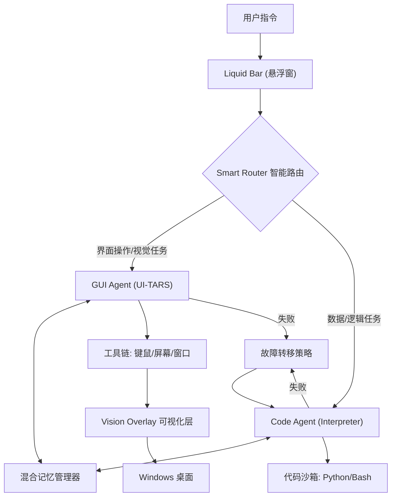

# Argus: The Liquid Desktop Agent 💧
> **让桌面自动化像水一样灵动、像人一样思考。**
> *Next-Gen Windows Agent powered by UI-TARS & Dual-Engine Architecture*

  

专为 Windows 设计的现代化智能代理，与传统的自动化脚本不同，Agent4 采用独创的 **"双脑协同" (Dual-Brain)** 架构，能够像人类一样"看"屏幕（通过 VLM），也能像极客一样用代码、命令行操作电脑。

它拥有极具未来感的 **Liquid UI** 悬浮界面，并首创 **Vision Overlay** 技术，将 AI 的操作轨迹实时可视化，实现了真正的“人机共驾”体验。

## 🌟 核心创新 (Key Innovations)

### 1. 🧠 智能双脑路由 (Smart Dual-Engine Router)
拒绝"一刀切"的模型调用。Agent4 内置智能路由器，根据任务类型自动切换 GUI/Code 模式：
- **👁️ 视觉右脑 (GUI Engine)**: 搭载 **UI-TARS** 视觉大模型，负责复杂的界面交互（点击、拖拽、识别图标）。
- **⚡ 逻辑左脑 (Code Engine)**: 内置 **Python解释器**，负责数据处理、文件操作、API调用等逻辑任务。
- **🔄 自动故障转移**: 当视觉操作失败时，自动切换至代码模式尝试解决，鲁棒性提升 200%。

### 2. ✨ 沉浸式可视化反馈Liquid UI (液态灵动界面)
- **异形悬浮**: 真正的无边框圆角设计，像灵动岛一样悬浮在桌面
- **极简风格**: 苹果风磨砂白配色，平时极小占用
- **视觉反馈**: 实时在屏幕上绘制点击波纹和操作路径 (Vision Overlay)，操作可视化。

### 3. 💾 混合记忆系统 (Hybrid Memory)
- **视觉剪枝 (Visual Pruning)**: 智能管理上下文窗口，自动丢弃过期的屏幕截图，保留文本逻辑。
- **长期洞察 (Insights Storage)**: 自动将成功的操作经验和用户偏好持久化存储 (`insights.json`)，越用越聪明。

### 4. 🤝 人机共驾机制 (Human-in-the-loop)
- **Human-in-the-loop**: 当 Agent4 遇到无法解决的困难时，不会直接崩溃，而是通过 Liquid Bar 优雅地请求人类介入。用户可以接管鼠标完成那一步，点击“我已协助”，Agent4 即可继续后续流程。

## 🏗️ 系统架构 (Architecture)



### 📦 核心组件

**Interface**
- **Liquid Bar** (`core/ui/app.py`): 主控悬浮条
- **Visualizer** (`core/ui/visualizer.py`): 全屏操作可视化层

**Agents**
- **GUIAgent**: 视觉驱动的自动化 (UI-TARS)
- **CodeAgent**: 代码执行与数据处理
- **SmartRouter**: 任务调度中枢

## 🚀 快速开始

### 1. 安装依赖
```bash
pip install -r requirements.txt
```

### 2. 配置环境变量

在[火山引擎](https://console.volcengine.com/ark)获取API_KEY，修改 `.env` 并配置:

```plaintext
GUIAgent_MODEL=doubao-1-5-ui-tars-250428
GUIAgent_API_BASE=https://ark.cn-beijing.volces.com/api/v3/
GUIAgent_API_KEY=

CodeAgent_MODEL=doubao-seed-1-6-flash-250828
CodeAgent_API_BASE=https://ark.cn-beijing.volces.com/api/v3/
CodeAgent_API_KEY=
```

### 3. 启动
**直接启动 (推荐)**:
```bash
python main.py
```
这将启动 **Liquid Bar** 悬浮窗。桌面顶部将出现悬浮灵动条，输入指令即可开始。

**命令行模式**:
```bash
python main.py --task "打开记事本并输入Hello"
```

## 📊 项目结构

```
agent4/
├── core/
│   ├── agents/         # 智能体核心 (GUI/Code/Router)
│   ├── tools/          # 5大工具集 (Mouse/Keyboard/Screen...)
│   └── ui/             # 界面层
│       ├── app.py      # Liquid Bar 主程序
│       └── visualizer.py # 屏幕可视化
├── memory_storage/     # ai记忆存储文件夹
├── main.py             # 通用入口
└── requirements.txt
```

## 🔧 高级功能

### 视觉操作反馈 (Vision Overlay)
Agent 在操作鼠标时，屏幕上会出现高亮波纹指示点击位置。这由底层的 `visualizer.py` 实现，支持**点击穿透**，完全不影响您的正常操作。

### 智能介入
当 Agent 无法完成任务时，Liquid Bar 会变色并请求帮助。您可以：
1. 点击 **"我已协助完成"** -> Agent 继续后续步骤
2. 修改指令 -> Agent 重试
3. 跳过当前步骤

---
*Agent4 Liquid - 让 AI 操作看得见、摸得着*
