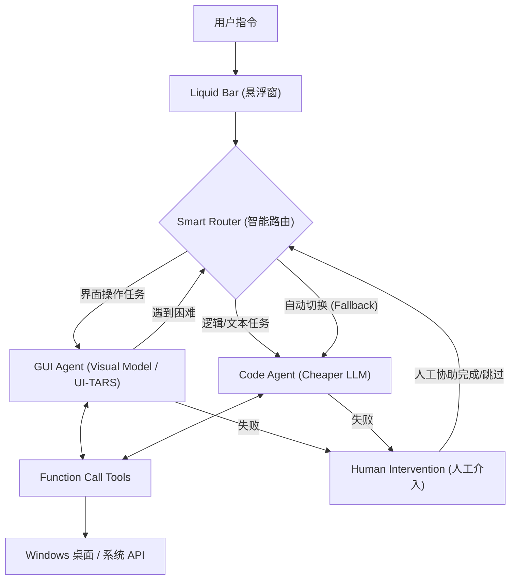

## 项目名称

 **Argus - The One Who Sees Everything**
>
> *Next-Gen Windows Agent with Dual-Engine Architecture & Smart Routing*
>
>   

Argus 是一款专为 Windows 平台打造的下一代智能 Agent。它旨在解决当前 GUI Agent 面临的**视觉模型 Token 消耗昂贵**、**长文本处理效率低**以及**容易陷入死循环**等痛点。

**核心亮点：**
*   **💡 降本增效**：创新性引入 **Code Agent (高性价比 LLM)** 协助 **GUI Agent (视觉模型)**。将昂贵的视觉算力集中在点击与识别上，而将逻辑计算、长文本处理和 API 调用等任务则分流给更经济的代码模型。
*   **⚡ 智能路由**：摒弃臃肿调度，采用轻量级路由，实现毫秒级“视觉/逻辑”模式切换，并支持自动故障转移。
*   **🛑 人机协作**：拒绝无效重试。当 Agent 遇到无法解决的问题时，主动请求人类介入协助操作或修改指令，保护您的钱包并提高任务成功率。
*   **✨ 沉浸式体验**：拥有极简悬浮窗和实时操作可视化。

## 运行条件

1.  **操作系统**：Windows 10 或 Windows 11。
2.  **运行环境**：Python 3.10 或更高版本。
3.  **模型服务**：
    *   需要兼容 OpenAI 格式的大模型 API Key。
    *   **推荐配置**：火山引擎 (Volcengine) 的 UI-TARS 1.5(视。
4.  **网络环境**：能够访问上述模型 API 的网络连接。

## 运行说明

### 方式一：直接运行 (推荐)
无需配置复杂的 Python 环境，您可以直接前往 **GitHub Releases** 下载最新版本的 `Argus.exe`。
*   下载后双击运行即可。
*   初次启动时，程序会引导您在界面中直接填入 API Key，无需手动修改配置文件。

### 方式二：源码部署 (开发者)

#### 1. 安装依赖
下载项目代码后，在终端中运行以下命令安装所需库：
```bash
pip install -r requirements.txt
```

#### 2. 配置环境变量
修改 `.env` 文件，配置您的模型 Key (推荐[火山引擎](https://console.volcengine.com/ark/region:ark+cn-beijing/overview)或兼容 OpenAI 格式的接口):

```plaintext
GUIAgent_MODEL=doubao-1-5-ui-tars-250428
GUIAgent_API_BASE=https://ark.cn-beijing.volces.com/api/v3/
GUIAgent_API_KEY=

CodeAgent_MODEL=deepseek-v3-2-251201
CodeAgent_API_BASE=https://ark.cn-beijing.volces.com/api/v3/
CodeAgent_API_KEY=
```

#### 3. 启动程序
运行主程序：
```bash
python main.py
```

### 使用方法
*   程序启动后，桌面顶部会出现 **Argus Liquid Bar (悬浮窗)**。
*   在输入框中输入您的指令（例如：“帮我打开记事本写一首关于春天的诗”），回车即可执行。
*   观察屏幕，Argus 会自动规划并通过鼠标/键盘完成任务。

## 测试说明

如果您希望验证 Argus 的**双引擎架构**与**路由能力**，建议进行以下测试：

*   **测试 GUI 引擎**：输入“打开浏览器并搜索 GitHub”，观察是否调用 UI-TARS 进行精准点击。
*   **测试 Code 引擎**：输入“计算斐波那契数列前10位并保存到本地文件”，观察是否路由至 Code Agent 直接生成代码并在后台执行，而非控制鼠标点击计算器。

## 技术架构

Argus 采用**双脑架构 (Dual-Brain)** 配合 **标准化工具层**：



*   **GUI Engine**: 搭载 UI-TARS，负责视觉感知、坐标定位、点击拖拽。
*   **Code Engine**: 搭载高性价比 Flash 模型，负责数据清洗、代码生成、逻辑判断。
*   **Hybrid Memory**: 智能管理上下文，自动剪枝过期的视觉截图数据，仅保留关键文本记忆。

## 目录结构

```text
Argus/
├── main.py              # 程序入口
├── .env                 # 环境变量配置
├── requirements.txt     # Python 依赖库
└── core/                # 核心代码
    ├── agents/          # 智能体与路由
    │   ├── smart_router.py # 智能路由器
    │   ├── gui_agent/      # 视觉模型 Agent
    │   ├── code_agent/     # 代码模型 Agent
    │   └── agent_memory/   # 记忆管理
    ├── tools/           # 工具函数库
    └── ui/              # 界面与交互
```

## 协作者

> ⚠️ 注：排名不分先后，按姓名首字母拼音排序。

<table>
  <tr>
    <td align="center"><b>冯泓皓</b><br><sub>华南理工大学 24级</sub></td>
    <td align="center"><b>郭与</b><br><sub>华南理工大学 25级</sub></td>
    <td align="center"><b>李静姝</b><br><sub>华南理工大学 25级</sub></td>
    <td align="center"><b>林子尊</b><br><sub>华南理工大学 24级</sub></td>
    <td align="center"><b>刘亦凡</b><br><sub>华南理工大学 24级</sub></td>
  </tr>
</table>
